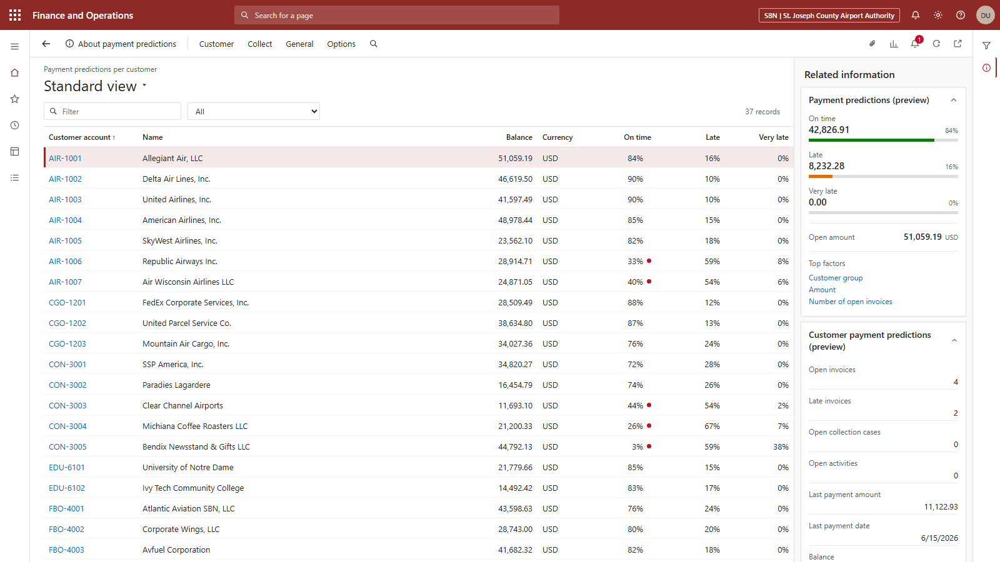
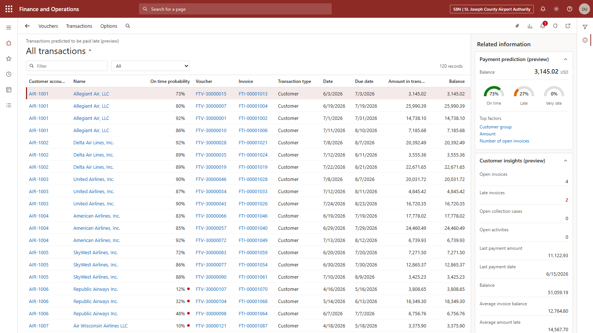
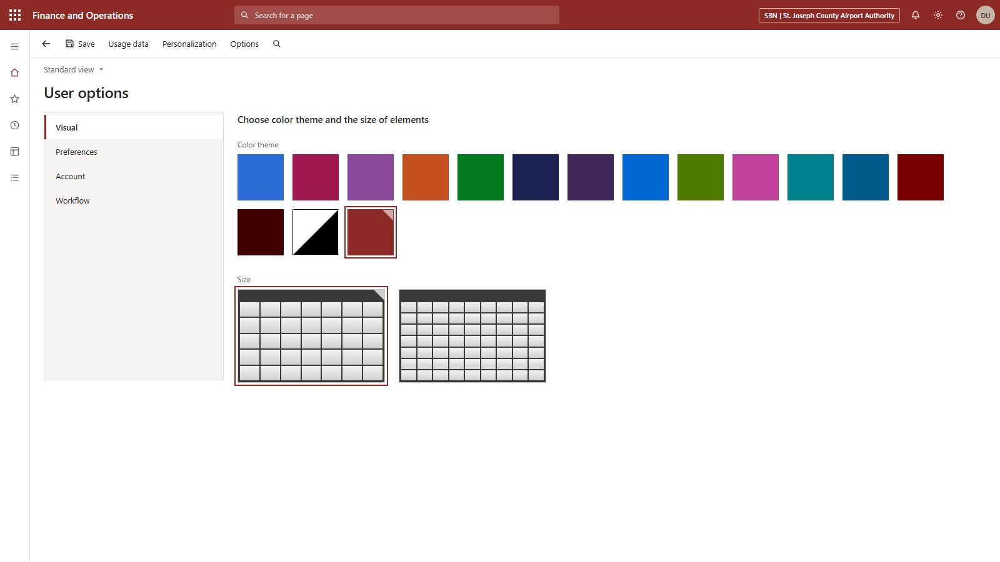

# D365 F&SC — Customer Payment Prediction demo kit

A working stand-in for the **Payment predictions (preview)** module in Dynamics
365 Finance & Supply Chain, for use when the real AI Builder model has no data
to show — which is what the RSMUS demo environment currently does:

> *"We are working on gathering data for this prediction. Check back later."*

Currently seeded for **benefit fund administration** — multiemployer
(Taft-Hartley) health & welfare funds and benefit trusts, the employers that
remit contributions to them, and public sector benefit plans. Billing covers
PEPM administration fees, claims processing, eligibility and COBRA
administration, employer contribution remittance, payroll compliance audit
recovery and Form 5500 / GASB 75 support.

A second pack, **South Bend International Airport**, ships alongside it —
airline landing fees, terminal rent, FBO and hangar leases, rental-car
concessions, parking, cargo and AIP grant billing:

```bash
python scripts/build_demo.py --seed airport --force-seed
```

Retargeting it at a different prospect is one spreadsheet edit and one command.



---

## Quick start

```bash
python scripts/build_demo.py
```

Then open `dashboard/payment-prediction.html` in any browser. That's the demo.

The same command regenerates `data/PaymentPrediction-Demo.xlsx`, which is also
the source for the Power BI report.

Requirements: Python 3.9+ with `openpyxl`. Nothing else — no network, no tenant,
no licence.

---

## What's in the box

| Path | What it is |
|---|---|
| `data/PaymentPrediction-Demo.xlsx` | **The one file you edit.** Inputs + generated dataset. |
| `dashboard/payment-prediction.html` | Self-contained F&O replica. Open and present. |
| `dashboard/template.html` | Source template — edit here for styling changes. |
| `scripts/build_demo.py` | Reads the workbook, regenerates everything, rebuilds the HTML. |
| `scripts/seeds.py` | Industry seed packs + billing lines per customer group. |
| `powerbi/BUILD-AND-EMBED.md` | Build the Power BI report and embed it in a D365 Analytics tab. |
| `powerbi/measures.dax` | All DAX measures, ready to paste. |
| `powerbi/d365-payment-prediction-theme.json` | Power BI theme that matches F&O styling. |

---

## The two demo surfaces, and when to use each

**`dashboard/payment-prediction.html`** — the pixel replica. Reproduces the F&O
header, action pane, left rail, both list pages, and the Related-information
fly-out including the three-arc gauges and Top factors. Nothing else reproduces
that fly-out; Power BI visuals can only approximate it.
Use it for the *"here's what the module looks like with your data in it"* story.

**The Power BI report** — lives on a real D365 Analytics tab, wrapped in real
F&O chrome. Use it for the *"and here's how you'd extend this with your own
analytics"* conversation. See `powerbi/BUILD-AND-EMBED.md`.

They read the same workbook, so they never disagree.



---

## Driving the HTML replica

| Action | Result |
|---|---|
| Click a row | Related-information pane follows the selection |
| Click a **customer account** link | Drills into that customer's predicted transactions |
| `Collect` in the action pane | All transactions predicted to be paid late |
| Back arrow | Returns to the per-customer list |
| Type in **Filter** | Live filter; the dropdown next to it picks the field |
| Click a column header | Sorts |
| Section headers in the right pane | Collapse / expand |
| **Gear icon** (or the avatar) | Opens **User options** — themes, density, legal entity, persona |

Deep links — bookmark these to open straight on the screen you want:

- `payment-prediction.html#customers`
- `payment-prediction.html#transactions`
- `payment-prediction.html#transactions/CON-3005` — opens drilled into one customer
- `payment-prediction.html#options/Account` — opens the settings page on a given tab

---

## User options — rebranding without touching the workbook

The gear icon opens a replica of the D365 **System settings > User options** page.
Changes apply instantly and are saved to browser local storage, so you can
retheme or rebrand in the ten seconds before a call without regenerating
anything.



**Visual** — the same fifteen colour themes D365 F&O offers, in the same order,
plus the brick red the current RSMUS environment uses:

`blue`, `berry`, `orchid`, `orange`, `green`, `darkblue`, `darkpurple`, `azure`,
`olive`, `pink`, `teal`, `steel`, `darkred`, `maroon`, `highcontrast`, `red`

Match whatever the prospect's own environment looks like and the demo stops
looking like a mock-up. **Size** switches element density between *comfortable*
and *compact*, exactly as D365 does.

**Account** — legal entity ID and name (the header chip), plus the demo persona:
user name, avatar initials, email. Leave initials blank and they derive from the
user name.

> This page sets *display identity only*. There is deliberately no password
> field and nothing to sign in to — the dashboard is a static file with no
> backend. Don't add one; a fake credential form is the one part of this kit
> that could be misused outside a demo room.

**Preferences** — demo name, aging period definition, and the at-risk threshold
(live — drag it and watch the red dots move). Currency and as-of date are shown
read-only because they're baked into the generated data.

**Workflow** — notification toggles, for completeness.

`Options` in the action pane resets everything back to the workbook defaults.

Whatever you set here is a per-browser overlay. To change the *starting* point
for everyone, edit the `Config` sheet and re-run the build.

Good accounts to steer toward during a demo:

- **C00027 Keystone Infrastructure Partners** — 2% on time, largest at-risk
  balance in the book, an open collection case, and contributions past 180 days.
- **C00028 Harbor Industrial Services** — 2% on time on Net 15 terms, five open
  documents, every one of them late.
- **C00023 Northeast Food Distribution** — the delinquency story in miniature:
  a contribution remittance, a liquidated-damages interest note, and a payroll
  audit recovery all aging together.
- **C00011 Northeast Carpenters Welfare Fund** — 85% on time, for contrast.

The narrative that lands in this industry: every fund and public plan pays
reliably, and all the collections exposure sits on contributing employers.
That is exactly where it sits in a real fund-administration ledger.

---

## Retargeting the demo

1. Open `data/PaymentPrediction-Demo.xlsx`.
2. **`Config` sheet** — set `Demo name`, `Legal entity`, `Organization`,
   `User name`, `Currency`, `As of date`. Set `Theme` to whichever of the
   sixteen themes matches their environment, and `Size` to `comfortable` or
   `compact`. (These are also changeable live from the in-app User options
   page — the workbook just sets the starting point.)
3. **`Input_Customers` sheet** — replace the rows. Nine columns:

   | Column | Notes |
   |---|---|
   | Customer account | Anything. Grouped prefixes (`AIR-`, `RAC-`) read well. |
   | Name | Shown in the grid |
   | Customer group | Drives billing lines; must match a group in `scripts/seeds.py` |
   | Payment terms | `Net 15` / `Net 30` / `Net 45` / `Net 60` |
   | Risk (0–1) | `1.00` = always pays on time, `0.20` = chronic late payer |
   | Aging profile | `current` / `mild` / `moderate` / `severe` |
   | Open transactions | How many open documents to generate |
   | City, Address | Shown in the Customer details pane |

4. Run `python scripts/build_demo.py`.
5. Refresh the Power BI report if you're using it.

To add billing lines for an industry you don't have yet, add a group to
`BILLING_LINES` in `scripts/seeds.py` — description, transaction type, and a
plausible amount range per line. Everything else generates itself.

Changing `Random seed` in `Config` reshuffles all amounts and probabilities
while keeping the same customers — useful if you've shown the same deck twice.

---

## How the numbers are generated

Not random — a logistic model, so the story holds up if someone interrogates it.

On-time probability is driven by the customer's risk score, how far past due the
document is, and its size:

```
z = 3.4·risk − 1.70 − 0.045·max(days_past_due, 0)
    + 0.60·(not yet due) − 0.28·log₁₀(amount / 10,000) + noise
on_time = 1 / (1 + e^−z)
```

The remainder splits between *late* and *very late*, with the *very late* share
growing as documents age and shrinking as risk score improves.

Consequences that make it defensible in the room:

- A customer's three percentages always sum to 100%.
- Customer-level percentages are **amount-weighted** across their open
  documents — same as the D365 FactBox, which is why On time + Late + Very late
  amounts always tie back to the open amount.
- Aged balance buckets are derived from actual due dates, so they tie to the
  balance exactly.
- Large invoices are predicted slightly later than small ones, and anything not
  yet due gets a real lift. Both hold true in actual AR data.
- The red dot appears below 60% on-time probability, matching the D365 grid.

`scripts/build_demo.py` prints a reconciliation summary every run.

---

## A note on the data

Every balance, date, probability and payment behaviour in this kit is
**synthetic**. No real organisation is portrayed as delinquent, and that is
deliberate — **keep the convention if you edit the customer list.** It costs
nothing and removes the only real risk in showing this to a client.

In the benefit funds pack every entity is fictional. The public sector plans
reference real jurisdictions, so they are held at reliable-payer risk scores;
all the delinquency sits on invented commercial employers (`Keystone
Infrastructure Partners`, `Harbor Industrial Services`, `Atlantic Construction
Services`, `Northeast Food Distribution`).

In the airport pack, real airline, rental-car and concession brand names are
used because recognising their own tenant list is what makes the demo land —
but the poor payers there are fictional too (`Bendix Newsstand & Gifts`,
`Hoosier Aviation Maintenance`, `Silver Hawk Aviation`, `Great Lakes Ground
Support`, and similar).

The disclosure lives on the **User options > Preferences** page rather than as a
banner across the dashboard, so it stays out of the way during a demo while
remaining present in the artefact. Worth leaving there.

This kit imitates a Microsoft product interface for demonstration purposes. It
is not affiliated with or endorsed by Microsoft, and it must not be presented as
a live Dynamics 365 environment.
